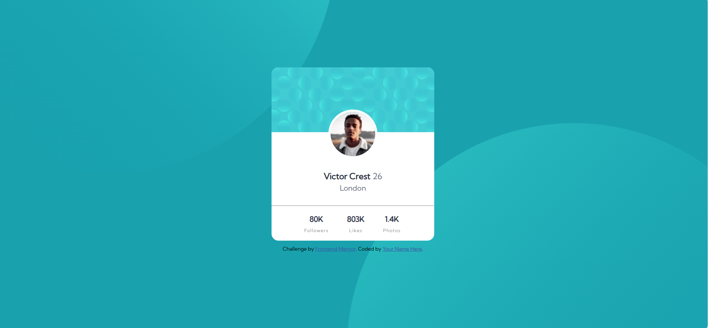

# Frontend Mentor - Profile card component solution

This is a solution to the [Profile card component challenge on Frontend Mentor](https://www.frontendmentor.io/challenges/profile-card-component-cfArpWshJ). Frontend Mentor challenges help you improve your coding skills by building realistic projects. 

## Table of contents

- [Overview](#overview)
  - [The challenge](#the-challenge)
  - [Screenshot](#screenshot)
  - [Links](#links)
  - [Built with](#built-with)
  - [What I learned](#what-i-learned)
- [Author](#author)


## Overview

### The challenge

- Build out the project to the designs provided

### Screenshot




### Links

- Solution URL: (https://github.com/madu-99/profile-card-component)
- Live Site URL: https://app.netlify.com/sites/madushi-profile-card-component/configuration/general

## My process

### Built with

- Semantic HTML5 markup
- CSS custom properties
- Flexbox
- CSS Grid
- Mobile-first workflow


### What I learned

```css
.image{
     transform: translate(0,-50%);
}
```

## Author

- Frontend Mentor - (https://www.frontendmentor.io/challenges/profile-card-component-cfArpWshJ/hub)https://www.frontendmentor.io/challenges/profile-card-component-cfArpWshJ/hub

